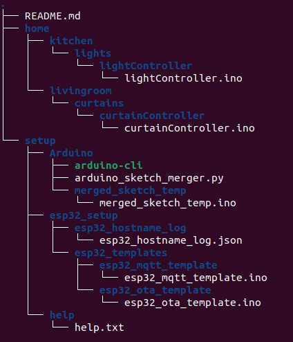

# Home Automation System Project

**Notice**: This project is intended as a learning resource and not for practical use. There are more robust options available for those seeking a comprehensive home automation solution.

## Introduction

This project presents a lightweight approach to home automation using a standard computer filesystem to organize the layout of your home. Designed specifically for Linux operating systems, it leverages the robustness of Linux's file system and command-line utilities, focusing on simplicity and efficiency with the use of esp32 boards.

## System Architecture

Below is a screenshot illustrating the system architecture in a tree format:



## Getting Started

### System uses

- **Linux Operating System**: The system is designed to work on a Linux distribution.
- **Arduino CLI**: Necessary for compiling and uploading sketches to esp32 boards. Place the `arduino-cli` executable in the `./setup/Arduino` folder. Provides a command-line interface for working with Arduino. [Official Arduino CLI documentation](https://arduino.github.io/arduino-cli/latest/).
- **Eclipse Mosquitto**: An MQTT broker that facilitates message queuing for automation tasks. [Download and setup guidance](https://mosquitto.org/download/).
- **Python 3**: Used for running scripts. Ensure Python 3 is available on your system.

### Installation

#### Clone the Repository

To get started with the home automation system, first, clone the repository to your local machine:

#### Setup third party tools

1. **Arduino CLI**: Download `arduino-cli` from its [official GitHub repository](https://github.com/arduino/arduino-cli) make sure the executable is located in `./setup/Arduino/`.

2. **Eclipse Mosquitto**: Install Eclipse Mosquitto by following the instructions on the [official Mosquitto website](https://mosquitto.org/download/).

#### Configuring Environment Variables 

You need to set up several environment variables. These variables are crucial for the system to function correctly, as they provide necessary information such as WiFi credentials and the MQTT server address.

Open your terminal and use the following commands to add these variables to your `.profile` file:

```bash
echo 'export WIFI_SSID="Your_WiFi_SSID"' >> ~/.profile
echo 'export WIFI_PASSWORD="Your_WiFi_Password"' >> ~/.profile
echo 'export MQTT_SERVER="Your_MQTT_Server_Address"' >> ~/.profile
```

Replace `Your_WiFi_SSID`, `Your_WiFi_Password`, and `Your_MQTT_Server_Address` with your actual WiFi SSID, WiFi password, and MQTT server address, respectively.

After adding these lines to your `.profile`, you need to reload the profile or log out and back in for the changes to take effect. To reload your profile, you can use the following command:

```bash
source ~/.profile
```

This step ensures that the necessary environment variables are available to the home automation system and any scripts or tools that require them.

### Esp32 first-time Setup

For the first-time connection of a new esp32 board, use the `-usb` flag to switch to USB port upload. Subsequent uploads can be done normally without the `-usb` flag by leveraging the Arduino OTA library. IP addresses are stored in the `esp32_hostname_log.json` file.

### Automatic Tracking

The system automatically keeps track of connected esp32 boards in the `esp32_hostname_log.json` file, simplifying device management. If `-usb` flag is not found the system automatically searches the `esp32_hostname_log.json` file for the correct port, returns an error if none is found.

## Usage

After installing and setting up your system, managing devices involves organizing Arduino sketches in the home directory and uploading them to your esp32 boards. Here's how to use the system effectively:

### Uploading Sketches

To upload an Arduino sketch to an esp32 board, navigate to the directory containing your sketch and use the following command structure:

```bash
sudo -E python3 ~/home-automation-system/setup/Arduino/arduino_sketch_merger.py path_to_your_sketch.ino {flags}
```

- `sudo -E`: Ensures the command runs with the user's environment variables.
- `python3`: Calls the Python interpreter.
- `~/setup/Arduino/arduino_sketch.py`: The path to the Python script that handles sketch uploads using the Arduino CLI.
- `path_to_your_sketch.ino`: Replace this with the actual path to your Arduino sketch file.
- `{flags}`: Replace this with any additional flags you might need for the upload process.

### Using the -help Flag

For more detailed information on what flags are available and how to use them, you can use the `-help` flag with the `arduino_sketch.py` script. Simply run:

```bash
python3 ~/home-automation-system/setup/Arduino/arduino_sketch_merger.py -help
```

This command will display a help message outlining the usage of the script, including a description of all available flags and options. For example, the first time you're connecting a new esp32 board, you might need to use the `-usb` flag to switch to USB port upload. The help message will provide guidance on using this flag among others.

### MQTT Network

Before communicating with your ESP32 devices, you need to set up the MQTT network. Follow these steps:

1. Start the MQTT broker by running the following command in your terminal:
   
    ```bash
    sudo systemctl start mosquitto
    ```

2. ESP32 devices use the following topic format: `file_path/esp_subbed`. ESP32 devices will listen for messages published to this topic.

   Example ESP32 device in `livingroom/curtains` is subscribed to a topic named `"livingroom/curtains/esp_subbed"`.

3. Send messages to ESP32 devices using the `mosquitto_pub` command. Replace `"server_ip"` with the IP address of your MQTT server, `"path/esp_subbed"` with the topic your ESP32 devices are subscribed to, and `"message"` with the content of your message. For example:

    ```bash
    mosquitto_pub -h "server_ip" -t "path/esp_subbed" -m "message"
    ```

   You can send messages to ESP32 devices with the command above.

### Tracking and Managing Devices

The system automatically tracks connected esp32 boards in the `esp32_hostname_log.json` file. This file keeps a log of device IP addresses and hostnames, simplifying the process of managing multiple devices within your home automation system.
